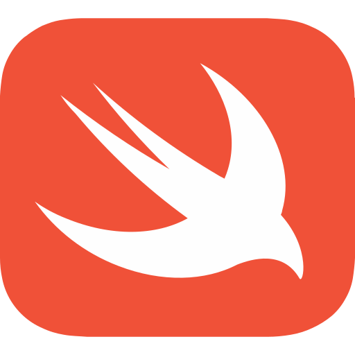

# code-shimasu


A collaborative code sharing and execution platform. Easily write, run, and share code snippets in multiple languages, with real-time collaboration and user profiles.

---

## 🚀 Features

- **Multi-language Code Editor**  
            
- Real-time code execution
- User profiles and snippet sharing
- Modern, responsive UI

---

## 🖼️ Features Gallery

### 🌐 Homepage

*The landing page welcomes users and provides quick access to the editor and user profile.*

### 📊 Coder Stats

*Track your coding activity and see your progress over time.*

### 📝 Editor Panel

*Write and run code in your favorite language with syntax highlighting and instant output.*

---

## ⚙️ How It Works

1. **Select a Language**  
   Choose from a wide range of supported languages using the language selector.
2. **Write Code**  
   Enter your code in the Monaco-powered editor panel.
3. **Run Instantly**  
   Click the Run button to execute your code and see the output below.
4. **Share & Collaborate**  
   Generate a shareable link to your snippet and collaborate in real time.

---

## 🛠️ Getting Started

### Prerequisites
- Node.js (v16 or higher)
- npm or yarn

### Installation
```sh
npm install
```

### Running the App
```sh
npm run dev
```

The app will be available at [http://localhost:3000](http://localhost:3000).

---

## 📁 Project Structure
- `src/` - Main application source code
- `convex/` - Backend logic and configuration
- `public/` - Static assets (including language icons and screenshots)

---

## 🤝 Contributing

We welcome contributions from the community! To contribute:
1. Fork the repository.
2. Create a new branch for your feature or bugfix.
3. Make your changes and commit them with clear messages.
4. Push your branch and open a pull request describing your changes.

For major changes, please open an issue first to discuss what you would like to change.

---

## 💬 Community & Contact

- For questions, suggestions, or support, open an issue or start a discussion on GitHub.
- You can also reach out via email (add your contact email here if desired).

---

## 📜 License
This project is licensed under the [GNU GPL v3](https://www.gnu.org/licenses/gpl-3.0.txt). 